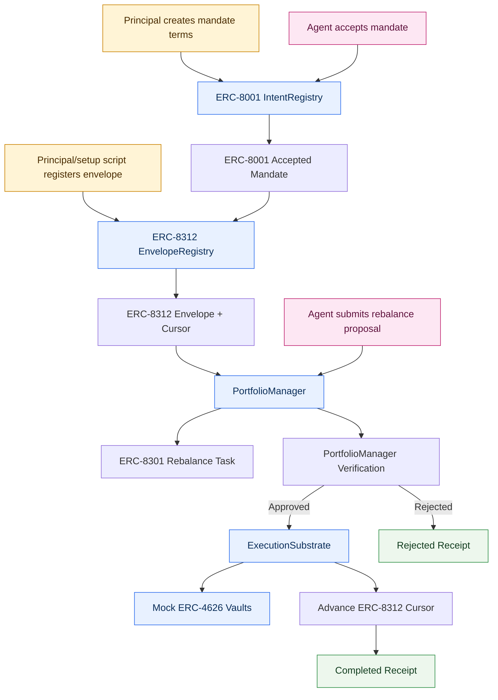

# mandated-vault-rebalancer

`mandated-vault-rebalancer` is the Headroom local architecture PoC showing how ERC-8001-shaped authority, ERC-8312-shaped bounded-action cursors, and an ERC-8301-shaped workflow can compose for a bounded autonomous DeFi workflow. A user and agent accept a shared mock ERC-4626 portfolio mandate, bind it into a live bounded-action envelope, route rebalance attempts through `PortfolioManager`, and execute only through `ExecutionSubstrate`.

The PoC proves the core composition:

ERC-8001 records the accepted mandate. ERC-8312 meters consumption of that mandate. `PortfolioManager` orders the rebalance workflow. `ExecutionSubstrate` enforces the live cursor and moves assets.

This is not a production DeFi protocol, a profitable yield strategy, or financial advice.

## Architecture

The portfolio uses 10,000 mock USDC allocated across six mock ERC-4626-style vaults:

| Vault | Risk bucket | Initial APY |
| --- | --- | ---: |
| Vault A | Core | 4.0% |
| Vault B | Core | 4.3% |
| Vault C | Growth | 5.1% |
| Vault D | Growth | 5.4% |
| Vault E | Experimental | 7.2% |
| Vault F | Experimental | 8.0% |

The accepted mandate commits to the principal, agent, approved asset, approved vaults, risk buckets, max 30% per vault, max 60% Growth plus Experimental, max 20% Experimental, minimum 50 bps yield improvement, max 8,000 mock USDC cumulative turnover, expiry, workflow type, and `agreementHash`.

The ERC-8312-shaped envelope binds to `_agentIntentDigest` and `agreementHash` through `capabilityRoot`. Its cursor exposes allocation by vault, allocation by risk bucket, cumulative turnover, remaining turnover, ordering marker, status, expiry, and `cursorRoot`.

`PortfolioManager` owns the ERC-8301-shaped task lifecycle: task creation, proposal submission, verification, execution settlement, completion, and rejection. It does not hold assets.

`ExecutionSubstrate` owns the simulated portfolio. It holds mock USDC, interacts with vaults, checks mandate constraints at execution time, and advances the ERC-8312 cursor only when execution succeeds. It does not create workflow tasks.



Diagram colors: blue elements are smart-contract-shaped modules, yellow elements are principal/setup actions, pink elements are agent actions, and green elements are receipts.

The PortfolioManager does not autonomously dispatch tasks. It is a smart contract-shaped coordinator and is triggered by transactions. In this PoC, tasks are created and advanced by local CLI scripts. In a fuller implementation, those transactions could be submitted by an offchain agent process, a keeper, or an automation service.

ExecutionSubstrate is the PoC enforcement surface. It can later be replaced or complemented by a real account or wallet architecture, such as an ERC-4337 smart account, an ERC-7579 modular account, a Safe module, an EIP-7702 delegation path, a Coinbase Agent Wallet / AgentKit setup, or another agentic wallet design. The intended stable boundary is that PortfolioManager owns workflow orchestration, while the execution substrate owns asset movement and mandate enforcement.

## Install

Requires Node.js 20 or newer.

```sh
npm install
```

There are no runtime package dependencies; `npm install` creates the lockfile and prepares local npm scripts.

## Commands

```sh
npm test                 # unit and integration tests
npm run lint             # local lint checks
npm run format:check     # formatting check
npm run format           # normalize trailing whitespace/newlines
npm run typecheck        # syntax checks for JS modules
npm run compile          # compile Solidity contracts with Hardhat
npm run build            # syntax checks and contract compilation
npm run chain            # start a local Hardhat JSON-RPC node
npm run deploy:local     # deploy the Solidity PoC to the local Hardhat node
npm run deploy:base-sepolia # deploy to Base Sepolia when RPC/private key env vars are set
npm run demo             # run all demo scenarios
```

Scenario commands are interactive by default:

```sh
npm run demo:happy
npm run demo:per-vault
npm run demo:risk
npm run demo:turnover
npm run demo:workflow
```

Each scenario pauses before every meaningful step and asks for confirmation after explaining what that step is about to do. You can also call the CLI directly:

```sh
node bin/mandated-vault-rebalancer.js demo:happy
node bin/mandated-vault-rebalancer.js demo:turnover
node bin/mandated-vault-rebalancer.js demo:all
```

Add `--automatic` to bypass prompts for CI, recording output, or scripted demos:

```sh
npm run demo -- --automatic
npm run demo:happy -- --automatic
```

## Local EVM Deployment

The default demo commands still work without a chain by using the in-memory simulation. To run the same individual scenario commands against deployed contracts, start a local Hardhat node and deploy first:

```sh
npm run chain
npm run deploy:local
npm run demo:happy
```

After `deploy:local`, individual scenario commands such as `npm run demo:happy`, `npm run demo:per-vault`, `npm run demo:risk`, `npm run demo:turnover`, and `npm run demo:workflow` detect `deployments/localhost.json` and use the local EVM when the node is reachable. The CLI prints transaction feedback for each onchain step:

```text
Submitting transaction: PortfolioManager.createTask
  tx: 0x...
  waiting for inclusion...
Included in block: 83
  gas used: 138151
```

For deterministic onchain scenario output, redeploy with `npm run deploy:local` before running another individual scenario. The local EVM is persistent, so a successful rebalance changes portfolio and cursor state for later commands. `npm run demo` continues to use the in-memory simulation for a deterministic all-scenarios walkthrough.

Rejected proposals are exercised through the contract path rather than simulated away. The CLI catches the revert, reports the contract rejection reason, and then shows that funds did not move and the ERC-8312 cursor did not advance. On Hardhat's local JSON-RPC server, some reverted sends are returned by the node before a transaction hash is exposed; the CLI prints `tx: not returned by local RPC` in that case and still decodes the Solidity revert reason. This differs from the in-memory simulation, which records local rejection receipts for educational inspection.

Base Sepolia uses the same deployment script:

```sh
BASE_SEPOLIA_RPC_URL=https://sepolia.base.org \
PRIVATE_KEY=0x... \
npm run deploy:base-sepolia
```

Base Sepolia demos are intentionally a second step after local EVM validation. The current CLI auto-detects `deployments/localhost.json`; Base Sepolia transaction-driving can reuse the same contract ABIs and deployment metadata once the local flow is stable.

CLI inspection commands:

```sh
node bin/mandated-vault-rebalancer.js init
node bin/mandated-vault-rebalancer.js inspect:intent
node bin/mandated-vault-rebalancer.js inspect:envelope
node bin/mandated-vault-rebalancer.js inspect:cursor
node bin/mandated-vault-rebalancer.js inspect:portfolio
node bin/mandated-vault-rebalancer.js inspect:receipts
```

The CLI also aliases scripted setup steps:

```sh
node bin/mandated-vault-rebalancer.js create-mandate
node bin/mandated-vault-rebalancer.js accept-mandate
node bin/mandated-vault-rebalancer.js create-envelope
node bin/mandated-vault-rebalancer.js deposit
node bin/mandated-vault-rebalancer.js allocate-initial
```

## Demo Scenarios

`demo:happy` moves 500 mock USDC from Vault A to Vault D. The target APY improves by 140 bps, Vault D reaches 30%, risk exposure remains within bounds, turnover becomes 500 of 8,000, the cursor advances, and a success receipt is recorded.

`demo:per-vault` attempts to move 700 mock USDC from Vault A to Vault D. Vault D would exceed the 30% per-vault cap, so the proposal is rejected, funds do not move, the cursor does not advance, and a rejection receipt is recorded.

`demo:risk` attempts to move 1,500 mock USDC from Vault A to Vault E. The target vault is approved and yield improves, but Growth plus Experimental exposure would exceed 60%, so the proposal is rejected.

`demo:turnover` starts with 7,700 of 8,000 mock USDC turnover already consumed. The agent proposes a 500 mock USDC move from Vault A to Vault D. The move is locally reasonable, but remaining cursor headroom is only 300, so ERC-8312-style aggregate metering rejects it. This is the central demonstration.

`demo:workflow` attempts execution before verification. `PortfolioManager` rejects the step violation before any `ExecutionSubstrate` action.

## Inspecting Cursor and Receipts

`inspect:cursor` prints the live cursor root, allocation by vault, risk-bucket exposure, cumulative turnover used, remaining turnover, status, expiry-derived active state, and last rebalance sequence.

`inspect:receipts` runs one valid attempt and prints the resulting receipt hash, task ID, result, reason, and amount. In code, receipts include task ID, intent digest, agreement hash, envelope ID, source/target vaults, amount, verification result, rejection reason, cursor before, cursor after when executed, allocation before, allocation after when executed, timestamp, and receipt hash.

## What Is Mocked

The token is a local mock USDC-like ledger. The vaults are minimal ERC-4626-style vaults with deposit, withdraw, balances, APY metadata, and risk metadata. Hashing uses Node.js `sha3-256` for deterministic local commitments. There is no chain, wallet signature validation, oracle, custody layer, or real strategy execution.

## Out of Scope

The PoC does not implement ERC-8183 or ERC-8275. It does not implement marketplace discovery, payment escrow, reputation, real DeFi integrations, oracle integrations, cross-chain support, or production custody assumptions.

## Security and Production Caveats

This project is an architecture simulation. A production system would need real EIP-712 signing, audited contracts, exact standard conformance decisions, reentrancy and accounting protections, oracle/rate integrity, custody threat analysis, access control, chain-specific failure handling, event indexing, and robust operational monitoring.

See [architecture.md](./architecture.md), [erc-mapping.md](./erc-mapping.md), [demo-script.md](./demo-script.md), and [threat-model.md](./threat-model.md).
