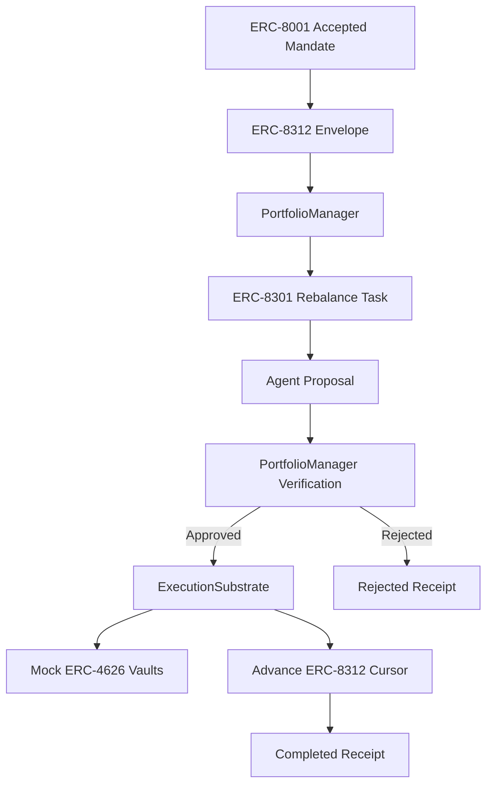

# Architecture

## Components

`IntentRegistry` is the ERC-8001-shaped authority layer. It creates structured mandate terms, computes `agreementHash`, computes `_agentIntentDigest`, records principal and agent acceptances, and exposes accepted intent details to downstream modules.

`EnvelopeRegistry` is the ERC-8312-shaped bounded-action layer. It registers an envelope against an accepted mandate, computes `capabilityRoot`, stores `cursorRoot`, exposes readable cursor state, enforces active/expired/revoked status, and advances the cursor only when a substrate witness matches the current cursor root and remaining turnover.

`PortfolioManager` is the ERC-8301-shaped workflow coordinator. It creates tasks, accepts proposals, runs verification, settles verified or rejected tasks, marks successful execution, and completes successful tasks. It rejects step skipping and resolved proposal reuse. It does not hold assets.

`ExecutionSubstrate` owns the mock portfolio. It holds mock USDC, deposits into vaults, withdraws from source vaults, deposits into target vaults, enforces mandate constraints at execution time, and advances the cursor as part of successful execution. If execution or cursor advancement fails, the local simulation restores token, vault, and envelope state. It does not create or advance workflow tasks.

`MandateVerifier` is deterministic policy logic. It reads accepted mandate terms, envelope status, cursor headroom, live substrate allocation, vault metadata, and workflow state before approving a proposal.

`ReceiptStore` records every attempted rebalance, successful or rejected.

## Accepted Mandate Flow

1. The user/principal and agent are encoded into structured mandate terms.
2. The registry computes `agreementHash` over those terms.
3. The registry computes `_agentIntentDigest` as the authority anchor.
4. Principal and agent accept the intent.
5. The intent reaches `Ready` and can be referenced by an ERC-8312-shaped envelope.

## Envelope Registration

1. The envelope registry requires an accepted intent.
2. `capabilityRoot` is computed from `_agentIntentDigest` and `agreementHash`.
3. The initial cursor is built from the starting allocation and max turnover.
4. `cursorRoot` commits to readable cursor state.
5. The envelope is registered as `Active`.

## Cursor Semantics

The cursor tracks current allocation by vault, allocation by risk bucket, total portfolio value, max cumulative turnover, cumulative turnover consumed, remaining turnover, last rebalance sequence, status, and expiry.

The cursor advances only after successful substrate execution. The witness binds to the previous cursor root, next allocation, turnover delta, task ID, and proposal hash. If the turnover delta exceeds remaining headroom, advancement is rejected.

## Trigger Model

The PortfolioManager does not trigger itself. It is a passive smart contract-shaped coordinator called by external transactions. In this local PoC, the CLI scripts create tasks, submit proposals, verify them, and settle them. In a fuller deployment those same calls could come from a user, an offchain agent process, a keeper, or an automation service. This update does not implement those external operators.

## Workflow Sequence

The workflow sequence is:

1. Task created.
2. Agent proposal submitted.
3. Proposal verified.
4. PortfolioManager settles the task.
5. ExecutionSubstrate executes and advances the cursor if approved, or records a rejection receipt if rejected.
6. PortfolioManager completes successfully executed tasks. Rejected tasks remain terminal at `Rejected`.

Execution before verification is rejected. Completion before execution or rejection is rejected. A resolved proposal cannot be submitted again.

## Verification and Execution Path

For a proposal, the verifier checks:

- accepted intent
- active and unexpired envelope
- authorized proposer
- approved source and target vaults
- source balance
- minimum yield improvement
- max allocation per vault
- Growth plus Experimental exposure
- Experimental exposure
- remaining turnover headroom
- workflow step validity
- proposal reuse

If approved, PortfolioManager issues the execution authorization to ExecutionSubstrate. ExecutionSubstrate withdraws from the source vault, deposits into the target vault, advances the cursor, and records a success receipt. If rejected, PortfolioManager does not authorize movement. ExecutionSubstrate records a rejection receipt, no funds move, and the cursor does not advance.

## Why PortfolioManager and ExecutionSubstrate Are Separate

PortfolioManager is the lifecycle and ordering surface. It answers whether a task exists, whether a proposal was submitted, whether verification has happened, and whether a resolved proposal is being reused.

ExecutionSubstrate is the enforcement and asset surface. It answers whether funds can move, whether the live cursor has headroom, and whether cursor advancement succeeded atomically with vault movement.

The boundary matters because the agent never moves funds directly. The agent proposes into the workflow. The substrate accepts only PortfolioManager-authorized execution of verified tasks.

## Happy Path

The happy path moves 500 mock USDC from Vault A to Vault D. The move improves yield, leaves Vault D at exactly 30%, keeps Growth plus Experimental at 55%, keeps Experimental at 0%, consumes 500 turnover, advances the cursor through ExecutionSubstrate, completes the PortfolioManager workflow, and records a receipt.

## Failure Path

The central failure path starts with 7,700 of 8,000 mock USDC turnover consumed. A proposed 500 mock USDC move from Vault A to Vault D satisfies local vault, yield, and risk checks. It fails only because remaining ERC-8312 cursor headroom is 300. PortfolioManager marks the task rejected, ExecutionSubstrate records a rejection receipt, and allocation and cursor root remain unchanged.
